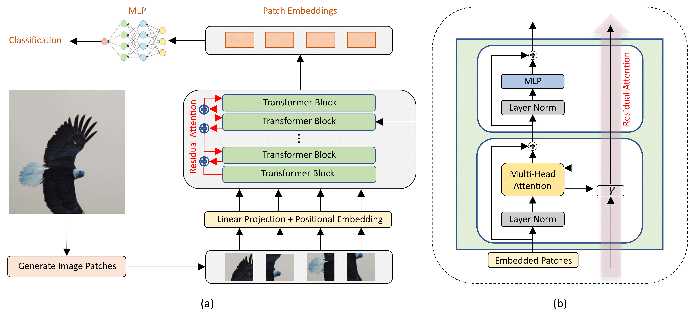

# [ReViT: Enhancing Vision Transformers with Attention Residual Connections for Visual Recognition]

Official PyTorch implementation of **ReViT**



---
ReViT is transformer architecture that exploits residual attention learning and serves as a general vision backbone for different visual recognition tasks:

> **Image Classification**: Included in this repo.

> **Object Detection and Instance Segmentation**: Implemented using mmdetection (https://github.com/open-mmlab/mmdetection)

# Results and Pre-trained Models
### ImageNet-1K trained models

| name | resolution |acc@1 | #params | FLOPs | Weights |
|:---:|:---:|:---:|:---:| :---:| :---:|
| ReViT-B | 224x224 | 82.4 | 86M | 17.5G | [model](https://drive.google.com/file/d/1U8-a3yw1HPcPscm6eTiROxyJJlwfzy6h/view?usp=drive_link) |
| ReMViTv2-T | 224x224 | 82.7 | 24M | 4.7G | [model](https://drive.google.com/file/d/1cBUzW7wJ1GUpd1CEgL_cSGd26b4s7U4d/view?usp=drive_link) |
| ReSwin-T | 224x224 | 81.5 | 29M | 4.5G |  [model](https://drive.google.com/file/d/14Wronoy-Bm-m9BJwHXgjDYJNTOouj_m5/view?usp=drive_link) |

# Installation

To run the project we suggest the use of a Docker environment following the docker setup found in Docker/Dockerfile

# Training

Here we can train a standard ReViT model from scratch by:
```
python main.py \
  --config_path config/config-ReViT-B.yaml \
  --num_gpus 2 \
```
To customize any hyperparemeter please check the config/config-ReViT-B.yaml file. Additionally, we suggest training on multiple GPUs to reproduce the same results as those reported in the above.
NOTE: Training ReViT on 2 V100 GPUs takes around 9 days and around 15 days with one GPU. To reproduce the results 2 V100 GPUs of 32GB are needed.
In order to run ReSwin and ReMViTv2 change the config-ReViT-B.yaml file with the appropriate one found in config. Both models would date around 9 days to train on 2 GPUs.

# Evaluation

Here we can perform evaluation for ReViT with the following command:
```
python main.py \
  --config_path config/config-ReViT-B.yaml \
  --num_gpus 2 \
```
Note that in config/config-ReViT-B.yaml a training flag is found and has to be set to False in order to perform an evaluation step. Weights will be available after the double blind review if accepted for the camera session.

# Directory structure
```
.
├── config
│   ├── config-ReViT-B.yaml
│   ├── config-ReSwin-T.yaml
│   ├── config-ReMViTv2-T.yaml
├── dataset
│   ├── data.py
│   ├── mixup.py
│   ├── rand_augment.py
│   ├── random_erasing.py
│   ├── transform.py
│   └── utils.py
├── Docker
│   ├── docker_commands.txt
│   ├── Dockerfile
│   ├── Dockerfile_detector
│   ├── os_requirements.txt
│   └── requirements.txt
├── epoch.py
├── main.py
├── model
│   ├── attention.py
│   ├── common.py
│   ├── loss.py
│   ├── lr_policy.py
│   ├── mmvit_model.py
│   ├── mmvit_model_.py
│   ├── optimizer.py
│   ├── swin_old.py
│   ├── swin.py
├── Readme.md
├── ReViT_attention_maps_eagle.png
├── ReViT.pdf
├── ReViT.png
├── run.py
├── trash
├── utils
│   ├── distributed.py
│   ├── metrics
│   ├── metrics.py
│   ├── model_stats.py
├── visualizer.ipynb
```


